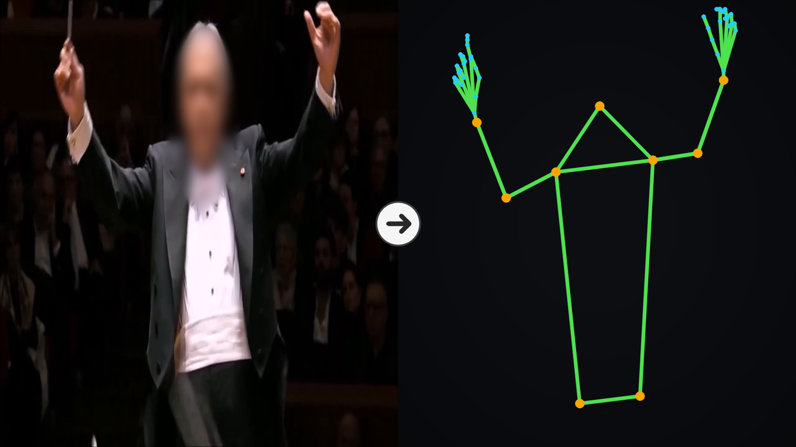

# Conductor Motion Dataset — skeletons, code, and weights

Companion release for *"Who Is Conducting? A Conductor Skeleton Dataset and
Identifiability Study from In-the-Wild Orchestral Concert Video"* (ISMIR 2026
LBD submission).

2D skeleton sequences of five orchestra conductors — **Abbado, Bernstein,
Dudamel, Haitink, Mehta** — extracted from in-the-wild concert videos spanning
six decades, with quality-control metadata, the identification code, and
trained classifier weights.


*Left: a source frame (face blurred). Right: an example use of the released skeletons — the 51 joints (nose, arms, hands, pelvis) used in the identification experiments. The release itself carries all 133 keypoints, with facial landmarks withheld.*

| | |
|---|---|
| Released runs (human-verified identity) | 1,447 (275 videos, ~328k frames, ~3.3 h) |
| Paper corpus (subset used in the experiments) | 1,300 runs · 249 videos · 218 performances · 2.7 h of curated segments |
| Keypoints | 133 (COCO-WholeBody, RTMPose) — facial 68 zeroed |
| Identification accuracy (paper protocol, 5 conductors) | **74.3 ± 1.2 %** per 3-s window (majority-class baseline 21.9 %) · 77.3 ± 2.1 % per clip · macro F1 0.740 |

The paper corpus is marked in `data/run_index.csv` via the `in_paper_corpus`
column; runs excluded from it carry the reason in `excluded_as`
(`duplicate` = same take uploaded more than once — only the copy with the
most usable material is kept in the experiments).

## What is in the box

```
data/
  packs/<Conductor>_XX.npz   compressed skeletons, one array per run (T,133,3)=(x,y,conf)
  meta_<Conductor>.json      per-run QC + provenance metadata
  run_index.csv              run catalog (also serves as the training CSV);
                             in_paper_corpus / excluded_as mark the paper subset
  recordings_meta.csv        per-video titles and recording-year fields
  canonical_bones.npy        canonical bone lengths (needed for normalization)
  experiments/
    segver_20260813.csv                segment-level identity audit
                                       (contaminated segments excluded in the paper)
    session_merges_perfonly_20260827.csv  same-performance groups with per-row evidence
                                       (title / audio overlap / archival research);
                                       folds never split a group
    audio_same_20260826.csv            true-duplicate clusters found by audio
                                       cross-correlation (kept one copy each)
    rehearsal_ood_20260826.csv         held-out out-of-distribution videos
                                       (rehearsals etc.) — blocked at training time
code/
  src/conductor_classifier/  model, graph, channels, sessions, windows, QC ...
  scripts/                   unpack_data.py, normalize_skeletons.py,
                             train_pilot.py (cross-validated evaluation),
                             train_final_model.py, static_frame_probe.py,
                             probe_pretrained.py, verify_repertoire.py,
                             verify_conf_era_proxy.py, bridge_test.py
weights/
  resgcn_5class.pt           ResGCN (~0.32M params) trained on all paper-corpus runs
                             under the paper protocol (T=75, zero-pad + masked
                             pooling, joint+bone-direction channels)
```

Raw video and audio are **not** included (copyright). `recordings_meta.csv`
and each run's `meta.json` carry the YouTube video id, source clip, and frame
range, so provenance is fully traceable.

## Keypoint layout

COCO-WholeBody order: 0–16 body (COCO-17), 17–22 feet, 23–90 face
(**zeroed in this release** — facial geometry of real persons is withheld;
our models never use it), 91–132 left/right hands (21 each). Third channel
is per-joint detector confidence, *not* depth.

## Quickstart

Requires Python 3.11+ with `pip install -r requirements.txt`
(numpy, torch, scikit-learn). A GPU is recommended for step 3.

```bash
# 1. unpack npz packs into per-run directories  → skeletons/<Conductor>/<run>/
python code/scripts/unpack_data.py

# 2. normalize (25 fps, 6 Hz low-pass, canonical bone lengths, foreshortening-preserving)
PYTHONPATH=code/src python code/scripts/normalize_skeletons.py \
    --root skeletons --mode bone --fore --canonical data/canonical_bones.npy

# 3. reproduce the paper's evaluation (one seed; the paper reports mean±SD over seeds 0–4)
PYTHONPATH=code/src python code/scripts/train_pilot.py \
    --csv data/run_index.csv --root skeletons \
    --joints both --use pos,vel,acc,bonedir \
    --T 75 --pad zeromask --min-real-frac 0.5 --supcon 0 \
    --seg-verdicts data/experiments/segver_20260813.csv \
    --session-merges data/experiments/session_merges_perfonly_20260827.csv \
    --dup-drops data/experiments/audio_same_20260826.csv \
    --ood-exclude data/experiments/rehearsal_ood_20260826.csv \
    --seed 0 --tag reproduce

# 4. static-frame probe (single-frame model; measures static cues alone)
PYTHONPATH=code/src python code/scripts/static_frame_probe.py \
    --csv data/run_index.csv
```

Windows are 3 s (75 frames at 25 fps); segments shorter than 3 s but with at
least 1.5 s of real frames are zero-padded, and the padded frames are excluded
from pooling by masking. Evaluation folds are assigned at the level of
**performances**: videos confirmed to come from the same concert — by title,
by partially overlapping audio, or by archival research — are grouped in
`session_merges_perfonly_20260827.csv` (every row carries its evidence, and
every merge was finalized by a human), and a group is never split across
folds. Contaminated segments (skeleton switching to a nearby musician) are
excluded via `segver_20260813.csv`. See the paper for the rationale.

### Using the trained classifier

```python
import torch
from conductor_classifier.resgcn import ResGCN
from conductor_classifier import graph as G, channels as CH

ck = torch.load("weights/resgcn_5class.pt", map_location="cpu", weights_only=True)
model = ResGCN(ck["input_channels"], len(ck["labels"]), G.adjacency(ck["joints"]))
model.load_state_dict(ck["state_dict"]); model.eval()
# input: a (75,133,3) window of *normalized* skeleton  →  CH.build_channels(...)
```

`weights/resgcn_5class.pt` is trained on **all** paper-corpus runs under the
paper protocol (the usual convention for released checkpoints). The
74.3 % / 77.3 % figures come from the cross-validated protocol above, not from
this single checkpoint; the checkpoint's `cv_reference` field records this.

## QC philosophy (why the data looks the way it does)

Pose spikes and identity switches are detected and cut, but **image quality is
never a reason to discard**: in a corpus spanning six decades, quality is a
proxy for the recording era, and filtering on it would curate the dataset by
era. QC decisions live in metadata only — thresholds can be revised without
re-running pose estimation.

## License

- **Code** (`code/`, `weights/`): MIT — see `LICENSE`.
- **Data** (`data/`): CC BY-NC 4.0 — see `LICENSE-DATA`. Skeleton coordinates
  are derived, non-photographic data; source videos remain the property of
  their rights holders and must be obtained from the original sources.

## Citation

The companion paper is currently under review (ISMIR 2026 Late-Breaking Demo);
this entry will be updated upon publication. Until then, please cite:

```bibtex
@misc{kim2026conductor,
  title        = {Who Is Conducting? A Conductor Skeleton Dataset and
                  Identifiability Study from In-the-Wild Orchestral Concert Video},
  author       = {Kim, Jiyun and Jeong, Dasaem},
  year         = {2026},
  howpublished = {\url{https://github.com/franziyun/conductor-motion-dataset}},
  note         = {Submitted to the ISMIR 2026 Late-Breaking Demo session}
}
```
